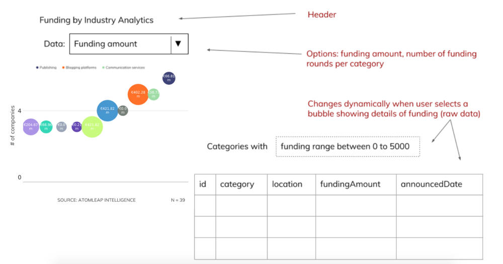

# Introduction

Welcome to the **delphai** full stack technical assessment.

This assessment consists of two parts:

  1. A strategy assessment to evaulate your approach to work through a specification
  1. A technical assessment to evaluate your approach towards implementing a technical solution

# Strategy assessment
  1. What would be your approach to creating a dashboard that deals with complex data (i.e., time-series and quantitative analysis of textual data; for example, the keyword results from a body of text). Which applications to create this dashboard would you choose and why? How would you assure outstanding usability?
  1. What are your top five state-of-the-art visualizations that would be beneficial for AtomLeap's clients? Why did you select them and what could be a potential application in the dashboard? (Think of an analyst in the strategy department of an enterprise corporation, that seeks to (a) provide an overview of innovation within various industry and technology fields and (b) assess individual organizations and their fit to their company's strategy).

# Technical assessment

## Background

Your task is to build a simple full stack web application to display some data in a bubble chart. Feel free to take your time with this task.

### Deliverables

The expected outcome of this assessment is one or more git repositories (on Github or another accessible service) that contains:

  1. A repository allowing us to run a RESTful API conforming to the specifications detailed in the following section
  1. A repository allowing us to run a React single page application that consumes the API provided by the above RESTful API
  1. One or many README files detailing how to run this application locally

Bonus points for:

  1. A clickable link to a deployed version of the above applications
  1. Generate randomized data for the API
  1. A method to test the API without the UI (OpenAPI specification, GraphQL endpoint, etfc.)
  1. Any other additional features
  1. A list of future enhancements you would like to make to this application

Feel free to choose any reasonable FOSS libraries/tools that may aid in your application development.

## Assessment details

### Back End

The back end will mimic a simple API to retrieve an array of data for funding secured by various companies in various industries. The shape of the retrieved items is as follows:

```typescript
{
  id: uuid,
  category: Beauty | Health | Games | Tools | Automative,
  location: United States | Indonesia | Brazil | Ukraine | Kosovo,
  fundingAmount: number(min: 2000, max: 4800000),
  announceDate: date(min: Oct 31 2011, max: Aug 6 2019),
}
```
You may use any language to build this API, though Typescript or Python are the preferred languages. A sample of this data is available [here](http://demo0377384.mockable.io/funding-test). You may choose to use the data provided by this mock data or choose to generate random data to mimic this structure.

### Front end

We would like a bubble chart visualization of funding volume per category, as well as the total number of funding rounds per  category presented in the data source. 
  
  * The X axis is a category axis with label value being the `category`
  * The Y axis is a value axis with the count of number of companies in the aggregation
  * The size of the bubble is determined by the aggregation chosen as detailed below

Data in the chart may be aggregated by

  * Total `fundingAmount`
  * Count of funding rounds

The expected UI should resemble the image below


### Typical usage

  * User opens the page and sees a bubble chart of funding per category, and does not see details.
  * The x-axis represents the categories, the size of the bubble represents the value selected in the dropdown i.e, funding amount/ *number of rounds. Y-axis represents the opposite data type i.e, number of rounds/funding amount.
  * When the user selects a bubble on the chart, a details table appears below.
  * If the user changes data to be shown, the bubble chart is updated and the details disappear.


### Assessment criteria

  * We are looking for clean, readable, and functional code. Ensure that your application runs successfully
  * A pleasant looking and intuitive UI
  * Though full coverage is not expected, some basic units tests for both the back end and front end are expected
  * Please keep your commit history so we can follow your thought process through this task
  * Use sane naming conventions that are appropriate for the languages you choose and descriptive variable names

## Questions and communication

Please contact us with any questions you may have about this task. If you feel anything about this task is unclear, please ask us rather than making any assumptions.